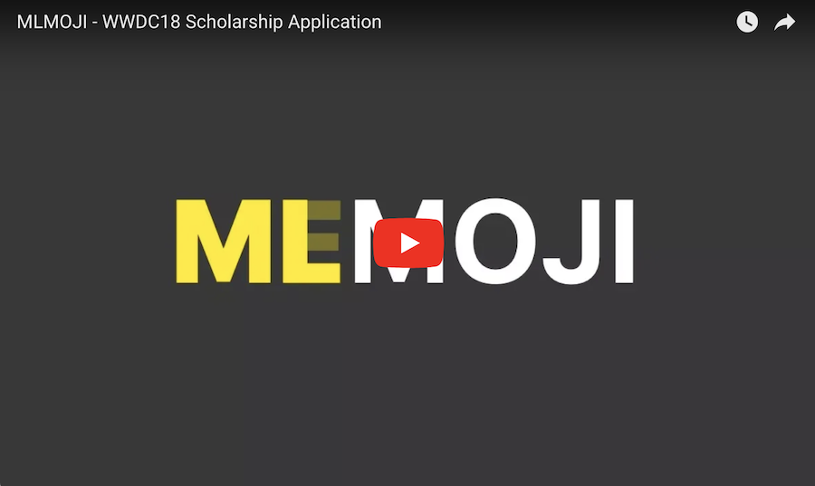

# MLMOJI

Emoji are becoming more central in the way we express ourselves digitally, whether we want to convey an emotion or put some fun into a conversation. This growth’s impact is visible on mobile devices. The available emoji keep increasing and it often requires a lot of swiping to find the right character.

My playground’s goal is to research a way to make this process more fun and intuitive. Using touch, Core Graphics, and deep learning, I implemented a keyboard that recognizes hand-drawn emoji and converts them to text.

You can download the playground book, the data set and the Core ML model from the [releases tab](https://github.com/alexaubry/mlmoji/releases). 

For a live demo, you can watch this video:

## 🔧 Building MLMOJI

The first step was to create the drawings themselves. I made a view that builds up points as the user’s finger moves on the screen and renders the stroke incrementally. When the user lifts their finger, a `UIGraphicsImageRenderer` flattens the strokes together into a static image, improving rendering performance. To achieve smoother lines, I used touch coalescing, which allows detection of more touch points.

The second core component of the playground is a classifier that recognizes a drawn emoji. Building it involved three tasks: gathering training data as images, training the model, and improving its accuracy.

The training data is used by the model to learn the features of each emoji class. This training data came from an app I built that uses the above drawing component to speed up the process of generating drawings.

With the training images now available, I looked into training a Core ML classifier. For this, a convolutional neural network (CNN) was appropriate because it learns efficiently for image recognition tasks.

Training a CNN from scratch can take several weeks because of the complexity of the operations applied to the input. Therefore, I used the “transfer learning” technique to train my classifier. This approach enables you to retrain a general, pre-trained model to detect new features.

Using the TensorFlow ML framework, a Docker container, and a Python script, I was able to train a small, fast, mobile-friendly neural network implementation (MobileNet) with each emoji’s features. I imported the resulting `mlmodel` into my playground.

The first version of the classifier was too specialized and not very reliable because my original data set was not large enough (only 50 drawings per class). I used data augmentation techniques (such as scaling, distortion, and flipping) to generate more training images from the manual drawings. Then I repeated the training process to reach a more acceptable accuracy.

Finally, using the Playground Books format, I created an interactive playground that explains the techniques used and demonstrates a proof of concept. Using features like the glossary and live view proxies, the book provides an accessible and enjoyable learning experience.

The final result comes with limitations. Because of the assignment’s time and size constraints, I was only able to train data for 7 emoji and to reach a somewhat fluctuating level of accuracy. However, building this playground taught me a lot about deep learning techniques for mobile devices and encouraged me to pursue further research in this field.
